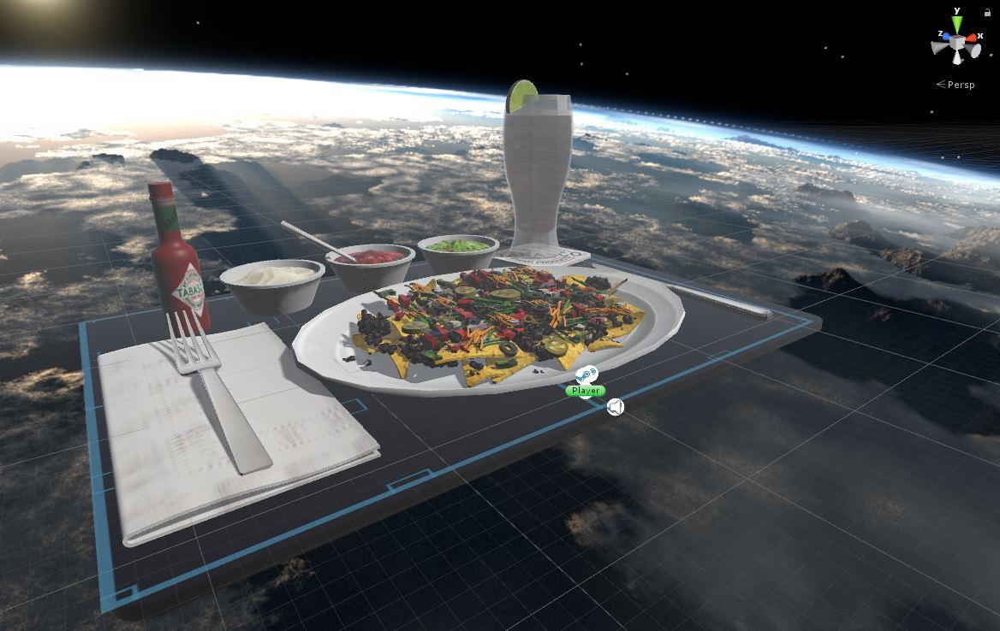

# Space Nachos VR

Walk amongst the Space Nachos. Supports Teleportation movement with SteamVR.

## Background

Friends were coming to visit. The one who never tried VR before said "Could I
walk on giant pile of nachos in VR?" I thought, "Sure LOL!" So I made this.

They loved it.

## Resources

A 10 minute Internet search found this great Sketchup model:
https://3dwarehouse.sketchup.com/model/911078b0ba119f325a34b9266b81f377/Nachos-Plate-of-chips-with-all-the-fixins

I read Unity would import SketchUp 2015 models with textures. It worked. Later
SketchUp file format versions may also, but I didn't try. This was good enough.

I imported, scaled 100X and called it done.

# Technical Details

This is a Unity 5.5.4p4 project using the SteamVR v2.0.1. It is not optimized
in any way. It's a simple joke.

## Reuse

Clone, delete the Nachos, import any other models for more silly.

